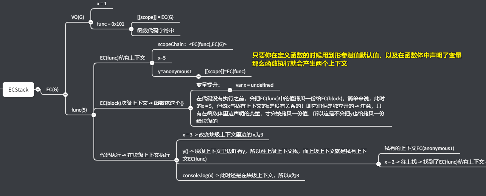
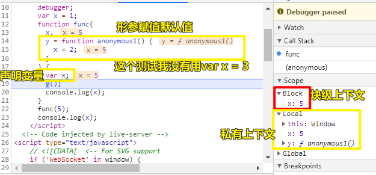

| ✍️ Tangxt | ⏳ 2020-06-23 | 🏷️ JS |

# 1~10

## 1、你以为函数调用执行就只会创建一个私有上下文吗？

有这么两段代码：

``` js
var x = 1
function func(x,y=function anonymous1(){x=2}) {
    x = 3
    y()
    console.log(x)
}

func(5)
console.log(x)
```

``` js
var x = 1
function func(x,y=function anonymous1(){x=2}) {
    var x = 3
    y()
    console.log(x)
}

func(5)
console.log(x)
```

请问，各自的结果是啥？

结果是：

``` js
2 1
3 1
```

可，为啥会是这样的结果呢？前者仅仅只是比后者多了一个`var`呀！

第一段代码的执行过程是这样的：

1. ECStack
2. EC(G)
   1. VO(G)
      1. x -> 1
      2. func -> 0x101：`[[scope]] -> EC(G)` + `形参x,y` + `函数体代码字符串`
   2. 代码执行
      1. `func(5)`
         1. AO(func)
            1. x -> 5 -> **3** -> **2**
            2. y -> 0x102：`[[scope]] -> EC(func)`+`'x=2'`
            3. arguments -> `{0:5}`（`y=xxx`这个默认值可不算数哈！）
            4. scopeChain -> `<EC(func),EC(G)>`
            5. this -> `window`
         2. `x = 3` -> 把`AO(func)`下的`x`改为`3`
         3. `y()`
            1. AO(anonymous1)
               1. arguments -> `{}`
               2. this -> `window`
               3. scopeChain -> `<EC(anonymous1),EC(func)>`
            2. `x = 2` -> 顺着作用域链往上找 -> 把`AO(func)`下的`x`改为`2`
            3. `return undefined`
            4. 释放内存
         4. `console.log(x)` -> 2
         5. `return undefined`
         6. 释放内存
      2. `console.log(x)` -> 找到全局变量`x` -> 1
   3. 代码执行完毕
3. ……

所以结果是`2、1`

那么第二段代码呢？

我们知道在ES6中存在块级作用域，即只要在`{}`里边变出现`let/const/function`就会形成所谓的块级作用域，也就块级上下文，当然，对象的`{}`除外……

然而，除了上述所说的这种情况以外，还有一种情况也会产生，而这是很多人都不晓得的！

这种情况的产生，需要满足两个条件同时成立：

1. 函数有形参赋值了默认值 -> 即你在定义一个函数的时候，其形参至少出现一次，如`x = xxxx`这种形参赋值…… -> 只有一行类似`x = 10`这样的代码就行了，即便API调用仔在调用函数的时候没有给`x`传参数
2. 函数体中有单独声明过某个变量 -> 用`var/let/const/function`都行，不过，你得注意，let声明的变量，可不能与形参变量名重名，不然会报错！

条件成立的话，那么在函数运行的时候，就会产生两个上下文，也就是两个作用域：

1. 第一个：函数执行形成的私有上下文 -> 其中有作用域链、形参赋值……
2. 第二个：函数体大括号包起来的是一个块级上下文（`EC(block)`）

> 这个知识点很重要：因为我们的代码经常会这样写，即你会用形参赋值+函数体中声明变量，如果出了bug的话，你不了解整个执行过的话，那么你是不会修复它的！

所以可有：



> 你可以通过debugger校验一下




